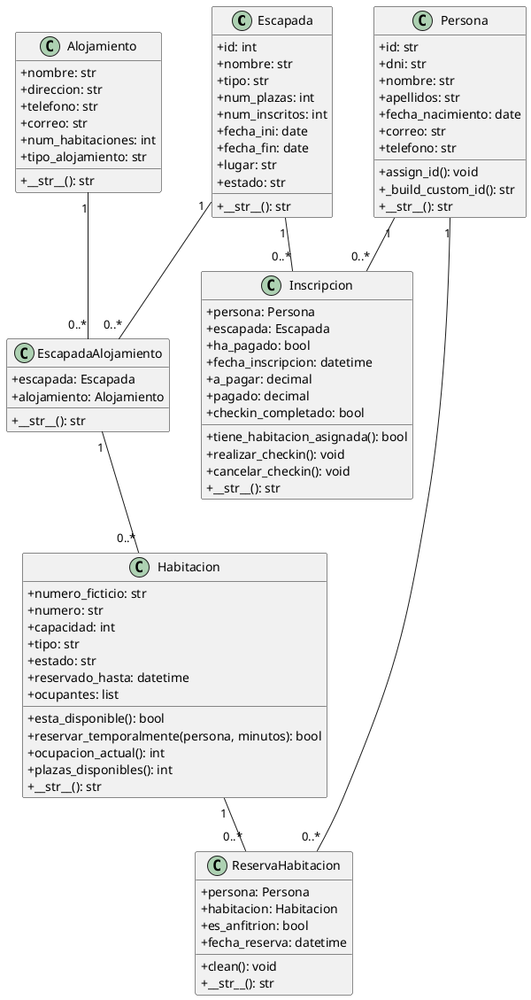

```plantuml
@startuml
skinparam classAttributeIconSize 0

class Escapada {
  +id: int
  +nombre: str
  +tipo: str
  +num_plazas: int
  +num_inscritos: int
  +fecha_ini: date
  +fecha_fin: date
  +lugar: str
  +estado: str
  +__str__(): str
}

class Alojamiento {
  +nombre: str
  +direccion: str
  +telefono: str
  +correo: str
  +num_habitaciones: int
  +tipo_alojamiento: str
  +__str__(): str
}

class EscapadaAlojamiento {
  +escapada: Escapada
  +alojamiento: Alojamiento
  +__str__(): str
}

class Habitacion {
  +numero_ficticio: str
  +numero: str
  +capacidad: int
  +tipo: str
  +estado: str
  +reservado_hasta: datetime
  +esta_disponible(): bool
  +reservar_temporalmente(persona, minutos): bool
  +ocupantes: list
  +ocupacion_actual(): int
  +plazas_disponibles(): int
  +__str__(): str
}

class Persona {
  +id: str
  +dni: str
  +nombre: str
  +apellidos: str
  +fecha_nacimiento: date
  +correo: str
  +telefono: str
  +assign_id(): void
  +_build_custom_id(): str
  +__str__(): str
}

class Inscripcion {
  +persona: Persona
  +escapada: Escapada
  +ha_pagado: bool
  +fecha_inscripcion: datetime
  +a_pagar: decimal
  +pagado: decimal
  +checkin_completado: bool
  +tiene_habitacion_asignada(): bool
  +realizar_checkin(): void
  +cancelar_checkin(): void
  +__str__(): str
}

class ReservaHabitacion {
  +persona: Persona
  +habitacion: Habitacion
  +es_anfitrion: bool
  +fecha_reserva: datetime
  +clean(): void
  +__str__(): str
}

Escapada "1" -- "0..*" EscapadaAlojamiento
Alojamiento "1" -- "0..*" EscapadaAlojamiento
EscapadaAlojamiento "1" -- "0..*" Habitacion
Persona "1" -- "0..*" Inscripcion
Escapada "1" -- "0..*" Inscripcion
Persona "1" -- "0..*" ReservaHabitacion
Habitacion "1" -- "0..*" ReservaHabitacion
@enduml
```
